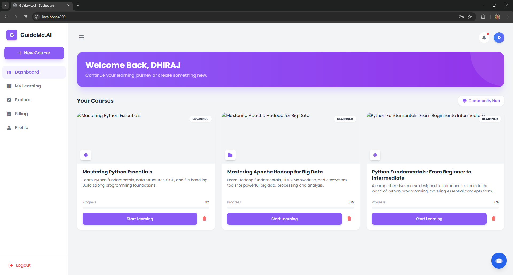
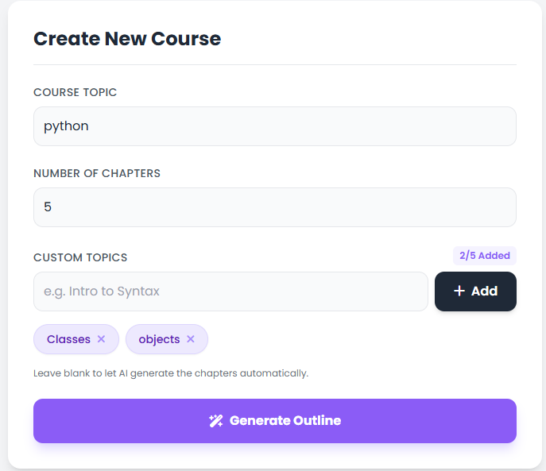
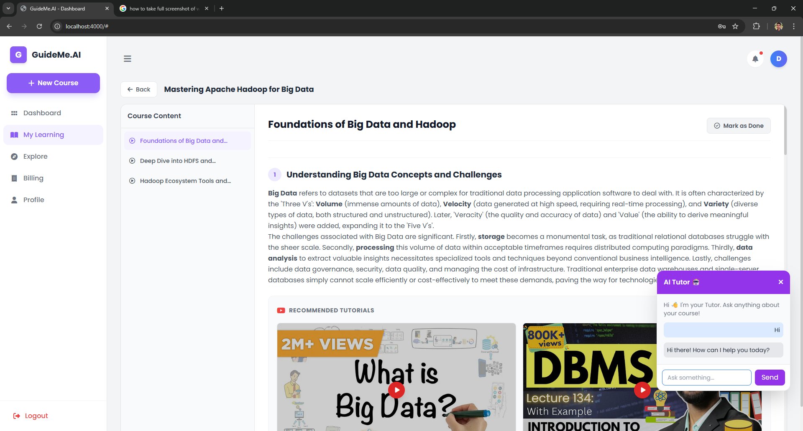

🚀 GuideMe.ai – AI Powered Course Generator

📚 About The Project

GuideMe.ai is an AI-powered E-Learning platform that generates a complete course based on the user's request.

Instead of searching for different tutorials on the internet, users can simply enter the topic they want to learn, and the system will automatically generate:

📍 A structured roadmap

🎥 Video explanations

📖 Theory notes

📑 Chapter-wise learning modules

This platform also provides a community hub where users can share generated courses and a chatbot assistant to solve doubts instantly.

✨ Key Features
🗺️ AI Course Roadmap

When a user requests a course, the system first generates a learning roadmap.

Example:

User Input: Learn JavaScript

Generated Roadmap:

Introduction to JavaScript

Variables & Data Types

Functions

DOM Manipulation

APIs

Projects

The user can review and approve the roadmap before generating the course.

📚 Chapter-wise Course Generation

After confirming the roadmap, the platform generates:

📖 Theory

🎥 Learning videos

🧠 Chapter explanations

📌 Subtopics

Users can also choose:

Number of chapters

Subtopics inside each chapter

🤖 AI Chatbot

A built-in AI chatbot assistant helps users solve doubts during learning.

Example questions:

"Explain closures in JavaScript"

"What is asynchronous programming?"

The chatbot responds instantly to help users continue learning.

🌍 Community Hub

Users can share their generated courses with the community.

Community members can:

Explore shared courses

Learn from other users

Discover trending topics

🛠 Tech Stack
Frontend

HTML

CSS

JavaScript

Backend

Node.js

Express.js

Database

MongoDB Atlas

Other Tools

Git

GitHub

VS Code

GuideMe.ai
│
├── controllers
│   ├── authController.js
│   ├── chatController.js
│   ├── communityController.js
│   └── courseController.js
│
├── frontend
│   ├── js
│   │   ├── auth.js
│   │   ├── chat.js
│   │   ├── community.js
│   │   ├── courseGenerator.js
│   │   └── dashboard.js
│   │
│   ├── index.html
│   ├── login.html
│   ├── signup.html
│
├── middleware
├── models
├── routes
├── utils
│
├── server.js
├── package.json
└── README.md

⚙️ Installation & Setup
1️⃣ Clone the Repository
git clone https://github.com/dhirajhack6/GuideMe.ai.git

2️⃣ Go to Project Folder
cd GuideMe.ai

3️⃣ Install Dependencies
npm install

4️⃣ Start the Server
node server.js

Server will start on:

http://localhost:3000

🧠 How It Works

1️⃣ User enters the course topic

⬇

2️⃣ AI generates a learning roadmap

⬇

3️⃣ User approves roadmap

⬇

4️⃣ Platform generates:

Chapters

Subtopics

Videos

Theory

⬇

5️⃣ User starts learning

<h1 align="center">GuideMe.ai</h1>

  

  

  

  

👨‍💻 Author

Dhiraj
Rohit
Devansh Patel
Harsh Yadav
Gaurav Yaduvanshi

GitHub:
👉 https://github.com/dhirajhack6

⭐ Support

If you like this project, please give it a star ⭐ on GitHub.

